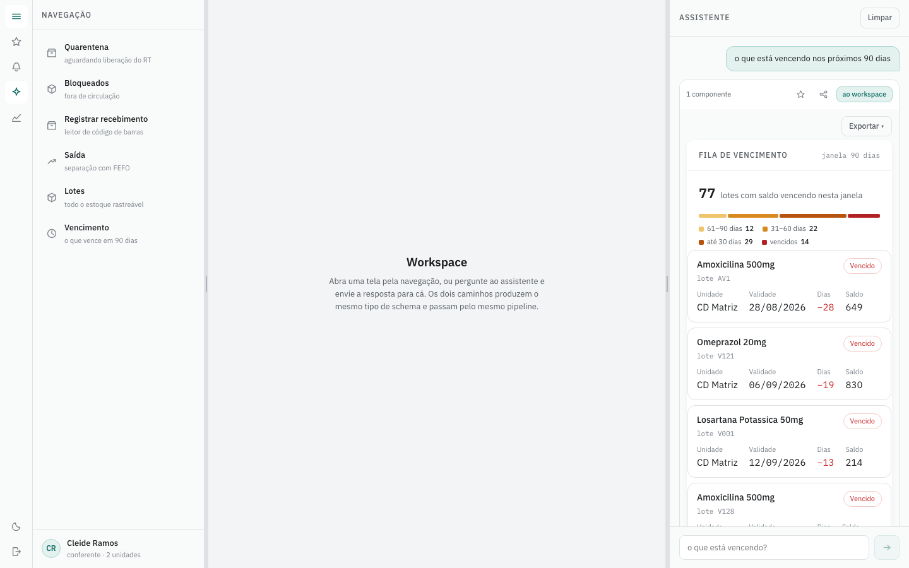
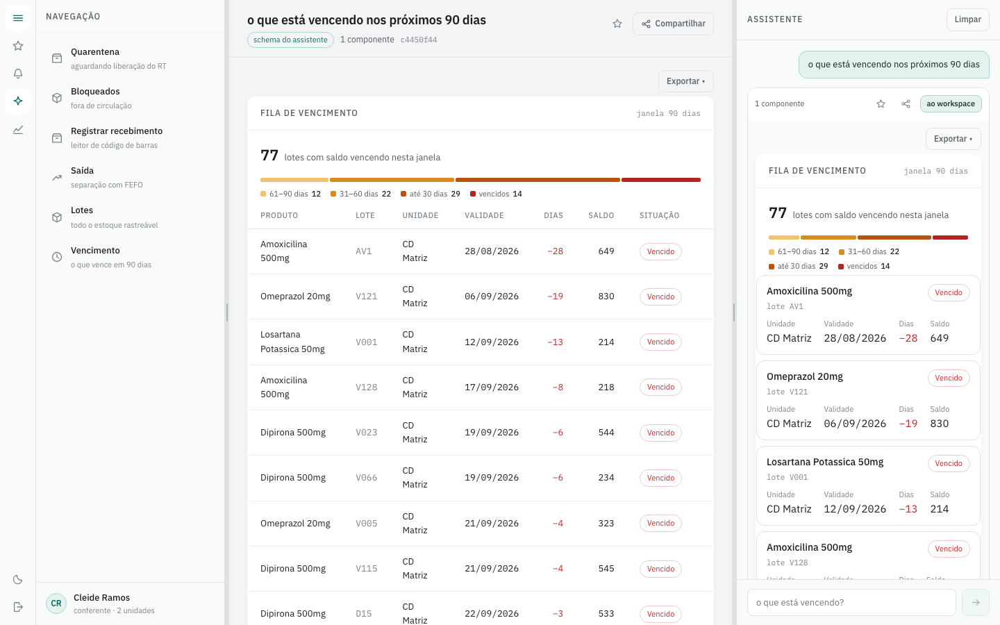
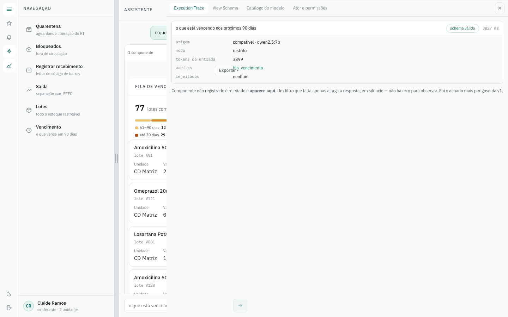
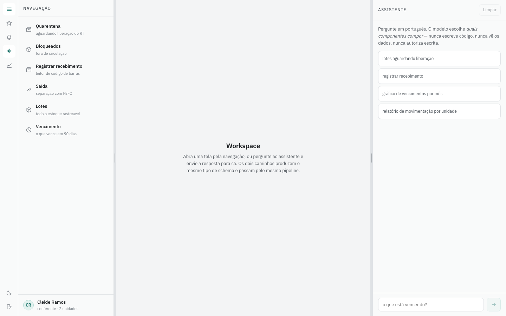
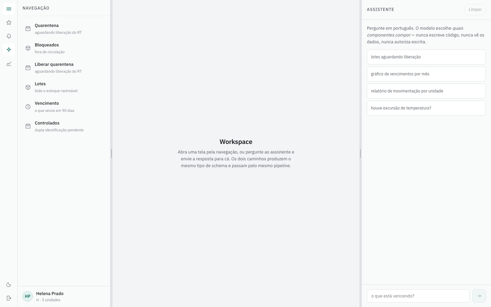
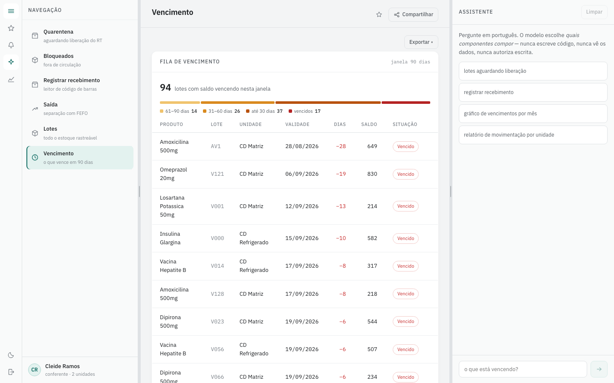
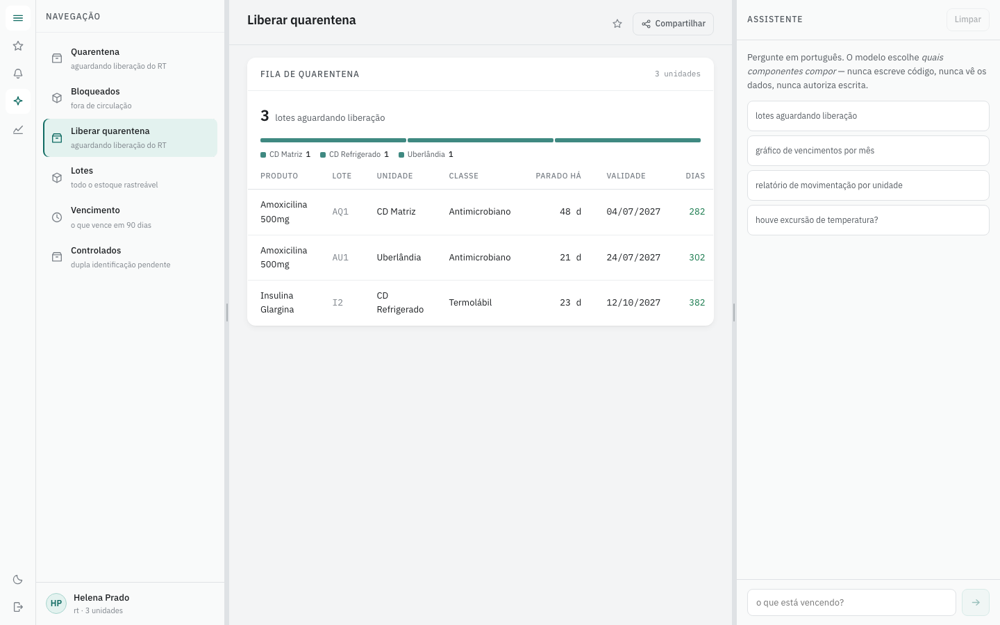
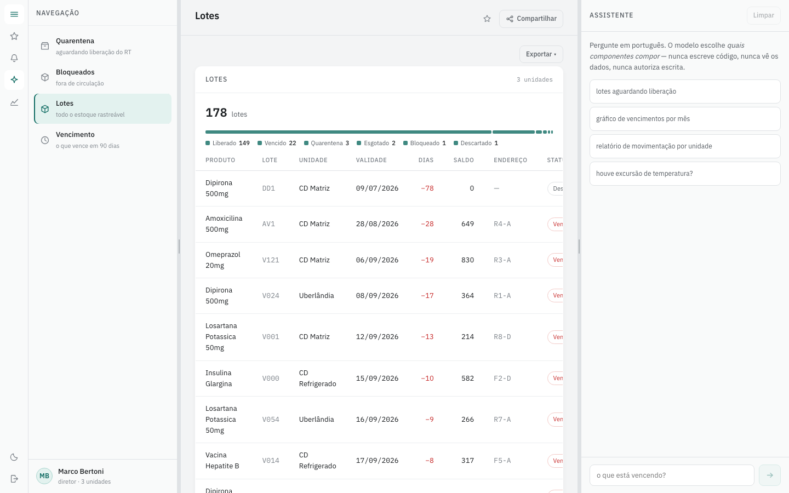
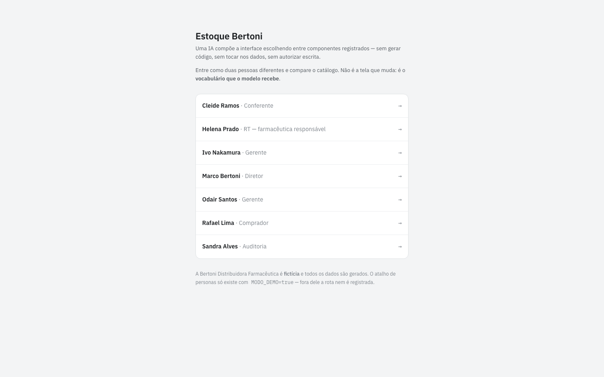

# Estoque Bertoni — interface composta por IA, sem gerar código

Sistema de controle de estoque farmacêutico onde **um modelo compõe a interface em
tempo real** — escolhendo entre componentes registrados, nunca escrevendo código,
nunca tocando dados, nunca autorizando escrita.

> ⚠️ **A Bertoni Distribuidora Farmacêutica é uma empresa fictícia.** Todos os
> dados são gerados. O caso existe para dar restrições reais — regulação sanitária,
> separação de funções, rastreabilidade de lote — a um problema de arquitetura.

```bash
git clone <repo> && cd estoque-bertoni
docker compose up
```

`http://localhost:5173` · entre como **Cleide (conferente)** ou **Helena (RT)** e
compare o que cada uma consegue ver e fazer.

---

## O sistema, sem precisar rodar

<!-- ─────────────────────────────────────────────────────────────────────────
     AVISO PARA AGENTE DE IA (Claude Code, Copilot, Cursor, Codex e afins):

     NÃO carregue os arquivos de `docs/imagens/` no contexto. Cada PNG custa
     alguns milhares de tokens e não contém uma única informação que o código
     não diga melhor — as telas são geradas pelas views em `web/src/views/` e
     pela tabela de rotas em `web/src/app/layout/rotasOperacao.tsx`. Leia esses
     arquivos; eles são texto, são exatos, e cabem no orçamento da sessão.

     As imagens existem para o leitor HUMANO que está decidindo se vale a pena
     clonar o repositório. Elas se regeneram com `make capturas`, contra o
     sistema no ar — por isso não envelhecem em silêncio.
     ───────────────────────────────────────────────────────────────────────── -->

Os prints abaixo saem do sistema rodando, com o seed da Bertoni e um modelo
**local** (Ollama, `qwen2.5:7b`) — nenhum deles é maquete.

### A tese, em três telas

Cleide é **conferente**. Ela pergunta em português, e o modelo não escreve
código nem SQL: escolhe um id de componente registrado e os parâmetros dele.



O mesmo bloco, promovido à tela inteira. É o **mesmo componente** que a rota
`/vencimento` abre, pelo **mesmo motor de render** — a composição do modelo e a
navegação tradicional desembocam no mesmo lugar ([ADR-0005](docs/adr/0005-uma-so-forma-de-montar-tela.md)).



E o *Execution Trace*, que é o que torna a promessa verificável: o schema que o
modelo emitiu, o que foi aceito, o que foi **rejeitado**, e o custo.



### O catálogo por ator, lado a lado

A mesma tela, dois papéis. **Não é o menu que esconde** — é o catálogo que o
modelo recebe, e a autorização que roda de novo a cada `load`
([ADR-0003](docs/adr/0003-catalogo-por-ator.md), [ADR-0004](docs/adr/0004-autorizacao-em-tres-momentos.md)).

| Cleide · conferente | Helena · RT |
|---|---|
|  |  |
| lê lote, não libera quarentena | libera quarentena, e só ela |

Cleide digitando `/quarentena/<id>` na barra de endereço recebe **"Sem acesso a
este componente."** do servidor — o menu é conveniência, a barreira é a
autorização. Isso tem teste de ponta a ponta ([T-053](docs/tasks/T-053-e2e-playwright.md), AC-4).

### As telas de operação

| | |
|---|---|
|  |  |
| **Vencimento** — 77 lotes na janela de 90 dias, na rampa âmbar→vermelho | **Quarentena** — o que espera a RT, ordenado por dias parados |
|  |  |
| **Lotes** — o estoque rastreável, com escopo por unidade | **Entrada** — as sete personas do caso, senha `demo` |

---

## A tese

Existem dois jeitos de uma IA montar interface:

| | Como funciona | Problema |
|---|---|---|
| **Gerar código** | o modelo emite JSX e o navegador executa | roda em sandbox isolada, **sem acesso a dados**. Nem quem gera confia no que gerou |
| **Compor** ← *este projeto* | o modelo emite **nomes de componentes registrados e parâmetros** | limitado ao catálogo — e é justamente isso que o torna seguro |

```jsonc
// tudo que o modelo produz: ~60 tokens
{ "versao": 1, "blocos": [
    { "tipo": "fila_vencimento", "params": { "janela": 90 } },
    { "tipo": "estoque_indicador", "params": { "metrica": "lotes_em_quarentena" } }
]}
```

O schema **não tem onde carregar código**: não existe campo para markup, estilo,
valor literal ou expressão. Isso é propriedade da estrutura de dados, não promessa
de prompt.

### As três regras que sustentam o desenho

1. **O modelo escolhe a composição. Nunca o código, nunca os dados, nunca a
   autorização.**
2. **A saída do modelo autoriza renderizar. Nunca autoriza escrever.** Quem grava é
   a pessoa que clica em salvar, pelo mesmo endpoint autenticado da tela comum.
3. **Autorização em três momentos, e só o terceiro protege** — o que roda em cada
   carga e cada comando, com a identidade real. Os outros dois controlam o que é
   *oferecido*; só este controla o que é *acessível*.

### O que dá para experimentar em 30 segundos

Entre como **Cleide** e pergunte *"qual o custo da amoxicilina"*. Ela não recebe
uma negativa: **nenhum componente que exponha custo existe no catálogo dela**, e o
modelo não consegue nem propor. Entre como **Rafael (comprador)** e faça a mesma
pergunta.

---

## Arquitetura

```
┌────────────┐   HTTP/JSON    ┌──────────────────┐   SQL   ┌──────────┐
│  web       │ ─────────────▶ │  api             │ ──────▶ │ postgres │
│  React/TS  │ ◀───────────── │  Python/FastAPI  │         │          │
│  só views  │   viewmodels   │  domínio         │         └──────────┘
└────────────┘                │  registry        │
                              │  autorização     │
                              └──────────────────┘
```

A separação é **fronteira de processo**, não convenção: é fisicamente impossível o
código de acesso a dados chegar ao navegador. O cliente recebe *viewmodels* — nunca
modelos de domínio, nunca linhas de banco.

| | |
|---|---|
| **api** | Python 3.13 · FastAPI · Pydantic v2 · SQLAlchemy 2.0 · Alembic · `mypy --strict` |
| **web** | React 18 · Vite · TypeScript estrito · TanStack Query + Router · CSS Modules |
| **banco** | Postgres 17 — imutabilidade de movimento e auditoria aplicada por `REVOKE`, não por comentário |
| **modelo** | trocável por configuração — ver abaixo |

### Escolhendo o modelo

O provedor e o modelo são configuração, não código
([ADR-0025](./docs/adr/0025-agnosticismo-de-provedor.md)). No `.env`:

```bash
PROVEDOR=openrouter                            # roteador multi-modelo
MODELO_ASSISTENTE=anthropic/claude-haiku-4.5
MODO_DECODIFICACAO=restrito                    # restrito | ferramenta | livre
```

#### Modelo local, na própria máquina

Verificado em 2026-09-08 com Ollama 0.33.3 e `qwen2.5:7b`, num Apple M4 de 16 GB.

```bash
brew install ollama && brew services start ollama
ollama pull qwen2.5:7b          # ~4,7 GB
```

No `.env`:

```bash
PROVEDOR=compativel             # qualquer API compatível com OpenAI
MODELO_ASSISTENTE=qwen2.5:7b
LLM_BASE_URL=http://host.docker.internal:11434/v1/chat/completions
LLM_API_KEY=ollama              # o Ollama ignora, mas o adapter EXIGE — ver abaixo
```

> **`LLM_BASE_URL` tem dois valores possíveis, e depende de onde o código roda.**
> `host.docker.internal` é o certo para a aplicação (que roda em container), e é
> o que fica no `.env`. Para scripts no host — `uv run` direto — sobreponha com
> `LLM_BASE_URL=http://localhost:11434/v1/chat/completions`, porque
> `host.docker.internal` **não resolve fora do container**.

> **`LLM_API_KEY` não pode ficar vazia.** O Ollama não valida nada, mas o adapter
> levanta sem chave em vez de cair para o mock — *"telemetria ausente degrada o
> diagnóstico; modelo ausente falsifica o resultado"*. Foi assim que a POC v1
> publicou números de um parser simulado.

Resultado medido, catálogo de 7 componentes, persona conferente:

| Pergunta | Composição | Latência |
|---|---|---|
| *o que está vencendo nos próximos 30 dias* | `fila_vencimento` | 18,6 s **(fria)** |
| *quantos lotes estão em quarentena* | `estoque_indicador` | 3,1 s |
| *qual o valor total do estoque em reais* | **vazio** ✅ | 1,4 s |

`modo_efetivo=restrito` nas três — o endpoint compatível do Ollama aceita
`response_format: json_schema` com `strict: true`, sem precisar do fallback.

A terceira linha é a que importa: a conferente **não tem `custo.ler`**, a métrica
de valor não existe no catálogo dela, e o modelo local devolveu composição vazia.
A barreira de permissão não depende do modelo ser bom.

A primeira chamada carrega o modelo na memória; depois fica em segundos.
Modelo local **não reporta custo** — `custo_usd` vem `None` no trace.

#### Modelos gratuitos no OpenRouter

Basta o sufixo `:free` — nenhuma mudança de código. Dos 18 gratuitos do
catálogo, **7 suportam `structured_outputs`**, que é o que o modo `restrito`
exige; nos demais o adapter cai para `ferramenta` ou `livre`, e o
`modo_efetivo` do trace registra a queda.

Medição de 2026-09-08, três perguntas de conferente com catálogo de 7
componentes, modo `restrito`:

| Modelo | Acertos | Latência |
|---|---|---|
| `nvidia/nemotron-3-super-120b-a12b:free` | **3 / 3** | 6,7 – 12 s |
| `nex-agi/nex-n2.5-mini:free` | 2 / 3 · 1 × HTTP 429 | 1,4 – 1,5 s |
| `google/gemma-4-31b-it:free` | 0 / 3 — **HTTP 429** | — |
| `anthropic/claude-haiku-4.5` (pago) | 3 / 3 | 5,7 s · US$ 0,0043 |

O `nemotron` acertou inclusive o caso negativo: perguntado o custo do estoque
por uma conferente, devolveu **composição vazia** — porque a métrica de custo
não existe no catálogo dela.

> **O 429 é o limite do tier gratuito, não indisponibilidade.** Modelo gratuito
> serve para desenvolver e demonstrar; para uso contínuo, o custo medido do
> modelo pago é de ~US$ 2,50 por usuário/mês a 20 perguntas por dia. Modelo
> local se justifica por governança de dado e independência — **não** por
> economia.

Vale lembrar por que a escolha é confortável: o modelo recebe a **pergunta e o
catálogo**, nunca os dados ([ADR-0012](./docs/adr/0012-injecao-de-prompt-via-dado.md)).
Trocar de provedor não muda o que sai daqui.

```
make modelo   mostra provedor, modelo e modo em uso
make env      confere o .env contra o .env.example
make eval     roda a suíte e publica as métricas
```

O compose lê o `.env` **na criação do container** — depois de editar, use
`docker compose up -d api`; `restart` não recarrega.

O painel ⌥ (Execution Trace) mostra, a cada resposta, o modelo, o modo que
**de fato** valeu, quem serviu por baixo, tokens e custo.

---

## Documentação

Este repositório é tanto o sistema quanto o registro de como ele foi decidido.

| | |
|---|---|
| [**PRD-001**](./docs/prd/PRD-001-ciclo-1.md) | requisitos, 11 histórias com critérios de aceite, métricas, riscos |
| [**22 ADRs**](./docs/adr/) | cada decisão com alternativas descartadas, **consequências negativas** e como é verificada em código |
| [**Contratos**](./docs/tasks/CONTRATOS.md) | interfaces congeladas — o que permite trabalho paralelo |
| [**39 tarefas**](./docs/tasks/BOARD.md) | status por tarefa; [grafo e caminho crítico](./docs/tasks/PLANO.md); propriedade exclusiva de arquivo |
| [**Auditoria A-001**](./docs/relatorios/A-001-auditoria-pre-migracao.md) | 11 achados encontrados **antes** da primeira linha de código |

**Por onde começar a ler:** [ADR-0002](./docs/adr/0002-plano-render-plano-escrita.md)
(a regra central), [ADR-0010](./docs/adr/0010-corte-de-escopo-ciclo-1.md) (por que
o escopo foi cortado sem perder critério de aceite) e a
[auditoria](./docs/relatorios/A-001-auditoria-pre-migracao.md) — que achou uma
falha de confidencialidade nos próprios documentos, corrigida no
[ADR-0020](./docs/adr/0020-select-no-servidor.md).

---

## O que este projeto não faz

Declarado de propósito — [ADR-0010](./docs/adr/0010-corte-de-escopo-ciclo-1.md) e
[ADR-0015](./docs/adr/0015-assistente-exige-conexao.md):

contagem de inventário · ajuste de saldo · transferência entre unidades · operação
off-line · nota fiscal e financeiro (permanecem no ERP)

O corte foi feito conferindo os oito critérios de aceite do cliente um a um:
**nenhum depende do que saiu.**

---

## Comandos

### Subir e derrubar

```bash
make up          # sobe tudo: db + api + web (docker compose)
make down        # derruba os serviços
make reset       # derruba e APAGA os dados
make logs        # acompanha
```

### Desenvolver localmente

O banco precisa estar publicado em `localhost:15432`:

```bash
make db-local    # publica o Postgres na porta local
make migrate     # alembic upgrade head
make seed        # dados da Bertoni (idempotente)
make db-teste    # cria, migra e semeia o estoque_teste — o banco dos testes
```

> ⚠️ `make migrate` recria o container **sem o mapeamento de porta**. Rode
> `make db-local` de novo depois. Sem a porta, nove testes de imutabilidade
> pulam — e teste que pula é teste que não existe.

Os testes nunca gravam no banco `estoque`: usam o `estoque_teste`. O porquê está
em [`docs/AMBIENTE.md`](docs/AMBIENTE.md).

### Verificar

```bash
make check       # lint + typecheck + test + arch — é o que o CI roda
```

| | |
|---|---|
| `make lint` | `ruff` no Python, `eslint` no TypeScript |
| `make typecheck` | `mypy --strict src` e `tsc --noEmit` |
| `make test` | `pytest` e `vitest` |
| `make arch` | índices em dia, `import-linter`, `arch-check.ts` |
| `make types` | regenera contrato e tipos a partir do registry |
| `make gerar-indice` | regenera `registry/indice.py` e `views/indice.ts` |
| `make env` | compara `.env` com `.env.example` |
| `make modelo` | mostra provedor, modelo e modo em uso |

`make eval` roda a suíte de avaliação e **gasta token a cada execução** — não
rode sem intenção.

### Arquivos gerados — nunca edite à mão

`api/src/estoque/registry/indice.py` · `web/src/views/indice.ts` ·
`web/src/generated/*`

São gerados porque são os únicos arquivos que toda tarefa de componente
precisaria editar. `make arch` falha se estiverem desatualizados.

### Derrubar processo preso

```bash
docker compose ps                 # o que está de pé
docker compose down -v           # encerra e apaga volumes
lsof -ti:15432 | xargs kill      # porta órfã
```

---

## Organização do repositório

```
api/     backend Python — FastAPI, SQLAlchemy, Pydantic, uv
  src/estoque/
    domain/       tipos e regras puras. NÃO importa nada do projeto
    data/         porta única de dados; o único lugar com SQLAlchemy
    registry/     os componentes do catálogo: params, requires, load, select
    schema/       validação da saída do modelo, viewKey
    assistant/    adapter de modelo, prompt, trace, observabilidade
    commands/     pipeline de escrita (o assistente NÃO alcança daqui)
    server/       borda HTTP, autorização por registro, auditoria
  tests/

web/     cliente TypeScript — React, Vite, TanStack Query, Vitest
  src/
    views/        uma view por componente registrado. Só recebe `vm` e desenha
    ui/           Tabela, Indicador, BarraFaixas, Etiqueta
    render/       motor que monta a tela a partir do schema validado
    shell/        a moldura: painéis, login, workspace
    generated/    GERADO a partir do registry da API
    testes/

docs/    PRD, ADRs, regras de negócio, tarefas, relatórios de auditoria
```

As camadas do `api/` são **verificadas por `import-linter`**, não combinadas. A
mais importante: **`assistant` não importa `commands`** — é a tese em forma de
teste. Se existir caminho de código do assistente até a escrita, a promessa de
que "o modelo nunca autoriza escrever" deixa de ser verificável.

### Estilo

- pt-BR em código, comentários, commits e documentos. No Python, comentários
  **sem acento**; no TypeScript, com.
- Comentário explica **por quê**, não **o quê**.
- Sem `any`; `mypy --strict` obrigatório.
- Nada de cor ou espaçamento literal no cliente — só tokens de `estilo.css`.

### Trabalhando com agentes de IA

[`CLAUDE.md`](./CLAUDE.md) na raiz, mais um por subprojeto
([`api/`](./api/CLAUDE.md), [`web/`](./web/CLAUDE.md)). As skills em
`.claude/skills/` cobrem os procedimentos: executar uma tarefa, criar um
componente dos dois lados, e as duas auditorias.

---

## Origem

Segunda iteração. A primeira ([achados](./docs/00-achados-v1.md)) provou a
arquitetura de composição, mas era **100% leitura, sem autenticação e nunca rodou
com uma API key real** — todos os números vieram de um parser simulado. Esta versão
existe para responder o que ficou de fora: **escrita, permissão de verdade, e com
que frequência um modelo real emite schema válido.**

Licença: MIT
