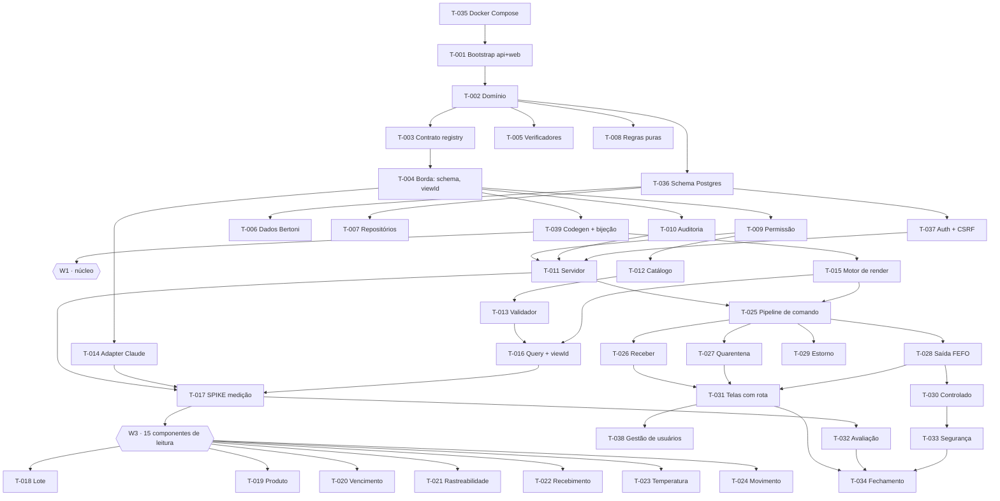

# Board — Ciclo 1

**39 tarefas · 6 ondas · 5 trilhas · 2 linguagens.**
Regras: [Acordo de Trabalho](./README.md) · Interfaces: [CONTRATOS](./CONTRATOS.md)

Legenda: `⬜ disponível` · `🔵 em andamento` · `🔴 bloqueada` · `🟡 em revisão` · `✅ concluída`

> **Assumir tarefa = editar a linha dela nesta tabela.** Esse commit é o lock.
>
> **Concluir = marcar os ACs verificados no arquivo da tarefa E mudar o status
> aqui, no MESMO commit.** Este board já foi ficção uma vez: dizia que nada
> tinha sido feito enquanto 19 tarefas estavam prontas
> ([A-002](../relatorios/A-002-auditoria-de-execucao.md)). O detalhe por tarefa
> está em [PROGRESSO](./PROGRESSO.md).

---

## 1. Ondas

Uma onda não é prazo, é **barreira de dependência**. Tarefas da mesma onda são
paralelizáveis; a seguinte abre quando as dependências declaradas fecham.

| Onda | O que é | Paralelismo | Abre com |
|---|---|---|---|
| **W0** | Ambiente e contratos congelados | **Serial** | — |
| **W1** | Núcleo: banco, dados, permissão, auth, registry, render | até 13 sessões | T-039 ✅ |
| **W2** | Furo de risco: medição com modelo real | 1 sessão | W1 ✅ |
| **W3** | 15 componentes de leitura | até 7 sessões | T-017 revisado |
| **W4** | 7 componentes de escrita | até 5 sessões | T-025 ✅ |
| **W5** | Garantias e fechamento | até 4 sessões | W4 ✅ |

**W0 é serial de propósito.** Sete tarefas em sequência compram treze simultâneas.

---

## 2. Trilhas

| Trilha | Domínio | Onde |
|---|---|---|
| **A** | Domínio e dados | `api/src/estoque/{domain,data}` · `api/migrations` |
| **B** | Servidor, permissão, auth, auditoria | `api/src/estoque/{server,autorizacao,auditoria,auth,commands}` |
| **C** | Registry e assistente | `api/src/estoque/{registry,schema,assistant}` |
| **D** | Render e interface | `web/src/**` |
| **E** | Ambiente e qualidade | raiz · `web/scripts` · `api/tests` · `eval/` |

**Tarefas de W3 e W4 atravessam A/C e D** — registro em Python, view em TypeScript
([ADR-0017](../adr/0017-registry-servidor-views-cliente.md)). O teste de bijeção
recusa meia entrega.

---

## 3. Grafo de dependências

**Caminho crítico** (12 tarefas):
`T-035 → T-001 → T-002 → T-003 → T-004 → T-039 → T-012 → T-015 → T-016 → T-017 → T-018 → T-027 → T-031 → T-034`

---

## 4. Tarefas

### W0 — Ambiente e contratos · serial

| Id | Tarefa | Trilha | Tam. | Depende | Status |
|---|---|---|---|---|---|
| [T-035](./T-035-docker-compose.md) | **Docker Compose, Makefile, README** | E | M | — | ✅ |
| [T-001](./T-001-bootstrap.md) | Bootstrap `api/` e `web/`, CI | E | M | T-035 | ✅ |
| [T-002](./T-002-dominio-tipos-erros.md) | Domínio: 7 tipos, erros, identidade | A | M | T-001 | ✅ |
| [T-003](./T-003-contrato-registry.md) | Contrato do registry (sem `render`) | C | M | T-002 | ✅ |
| [T-004](./T-004-contratos-de-borda.md) | Schema, `viewKey`/`viewId`, envelope | C | M | T-002, T-003 | ✅ |
| [T-039](./T-039-codegen-e-bijecao.md) | **Codegen OpenAPI→TS + bijeção** · congela | C | M | T-003, T-004 | ✅ |
| [T-005](./T-005-arch-check.md) | Verificadores: `import-linter` + `arch:check` | E | M | T-002 | 🟡 |

### W1 — Núcleo · até 13 sessões

| Id | Tarefa | Trilha | Tam. | Depende | Status |
|---|---|---|---|---|---|
| [T-036](./T-036-schema-postgres.md) | **Schema Postgres, migrações, restrições** | A | G | T-002, T-035 | ✅ |
| [T-006](./T-006-fixtures.md) | Dados da Bertoni (seed determinístico) | A | M | T-036 | ✅ |
| [T-007](./T-007-repositorios.md) | Porta de dados e repositórios SQLAlchemy | A | M | T-036 | ✅ |
| [T-008](./T-008-regras-puras.md) | FEFO, validade, **status efetivo**, saldo | A | M | T-002 | ✅ |
| [T-009](./T-009-motor-de-permissao.md) | Motor de permissão e escopo | B | M | T-004 | ✅ |
| [T-010](./T-010-auditoria.md) | Trilha de auditoria append-only | B | M | T-004 | ✅ |
| [T-037](./T-037-autenticacao.md) | **Autenticação, sessão, CSRF** | B | G | T-004, T-036 | ✅ |
| [T-011](./T-011-servidor.md) | Servidor FastAPI, autorização por registro | B | G | T-009, T-010, T-037 | 🟡 |
| [T-012](./T-012-catalogo.md) | Registry runtime e catálogo por ator | C | M | T-004, T-009 | ✅ |
| [T-013](./T-013-validador-schema.md) | Validador de schema e revalidação | C | M | T-012 | ✅ |
| [T-014](./T-014-adapter-modelo.md) | Adapter Claude e Execution Trace | C | M | T-004 | ✅ |
| [T-015](./T-015-motor-de-render.md) | Motor de render e política de layout | D | M | T-039 | ✅ |
| [T-016](./T-016-query-e-viewkey.md) | TanStack Query, `viewId`, rotas | D | M | T-013, T-015 | 🟡 |

### W2 — Furo de risco · 1 sessão

| Id | Tarefa | Trilha | Tam. | Depende | Status |
|---|---|---|---|---|---|
| [T-017](./T-017-spike-medicao.md) | **SPIKE: medição com modelo real** | C | M | T-011, T-014, T-016 | 🟡 |

> **A tarefa que pode matar o projeto**, e por isso está aqui e não no fim.
> **Nenhuma tarefa de W3 começa antes de o relatório R-001 ser lido.**

### W3 — Leitura · até 7 sessões · 15 componentes

| Id | Tarefa | Componentes | Tam. | Status |
|---|---|---|---|---|
| [T-018](./T-018-componentes-lote.md) | Lote | `lote_lista` `lote_detalhe` `lote_movimentos` `quarentena_fila` | G | ✅ |
| [T-019](./T-019-componentes-produto.md) | Produto e custo restrito | `produto_ficha` `produto_saldo_por_unidade` | M | ⬜ |
| [T-020](./T-020-vencimento-indicador.md) | Vencimento, indicador e curva | `fila_vencimento` `estoque_indicador` `vencimento_grafico` | G | ✅ |
| [T-021](./T-021-rastreabilidade.md) | Rastreabilidade `CA-01` | `rastreabilidade` | M | ⬜ |
| [T-022](./T-022-recebimento-leitura.md) | Recebimento | `recebimento_lista` `recebimento_detalhe` | M | ⬜ |
| [T-023](./T-023-temperatura.md) | Cadeia fria `CA-07` | `temperatura_historico` `temperatura_excursoes` | M | ⬜ |
| [T-024](./T-024-movimento-auditoria.md) | Movimento e trilha | `movimento_lista` `auditoria_trilha` | M | ⬜ |

### W4 — Escrita · até 5 sessões · 7 componentes

| Id | Tarefa | Componentes | Tam. | Depende | Status |
|---|---|---|---|---|---|
| [T-025](./T-025-pipeline-de-comando.md) | Pipeline de comando e confirmação | *(nenhum — ver nota)* | G | T-011, T-015 | ⬜ |
| [T-026](./T-026-recebimento-registrar.md) | Registrar recebimento | `recebimento_registrar` | G | T-025, T-022 | ⬜ |
| [T-027](./T-027-quarentena-e-status.md) | Quarentena e status | `quarentena_liberar` `lote_status_acao` | G | T-025, T-018 | ⬜ |
| [T-028](./T-028-saida-fefo.md) | Saída com FEFO | `movimento_saida` | G | T-025, T-008 | ⬜ |
| [T-029](./T-029-estorno-descarte.md) | Estorno e descarte | `movimento_estorno` `movimento_descarte` | M | T-025, T-024 | ⬜ |
| [T-030](./T-030-controlado-autorizar.md) | Dupla identificação `CA-04` | `controlado_autorizar` | G | T-028, T-024 | ⬜ |

> **`confirm_action` saiu do catálogo** (achado A-05). Confirmação é decisão do
> motor de render diante de `CommandDef.confirm`, não composição que o modelo
> escolhe — mesmo tratamento de `sem_acesso`.

### Abertas pela auditoria A-002

| Id | Tarefa | Trilha | Tam. | Depende | Status |
|---|---|---|---|---|---|
| [T-040](./T-040-csrf-e-rate-limit.md) | **CSRF e rate limit** — segurança prometida e ausente | B | M | T-037 | ✅ |
| [T-041](./T-041-ci.md) | CI no GitHub Actions | E | P | T-001 | ⬜ |
| T-043 | Instrumentação ao vivo do pipeline do assistente (duração real de span) | C | M | T-011 | ⬜ |

### W5 — Garantias e fechamento · até 4 sessões

| Id | Tarefa | Trilha | Tam. | Depende | Status |
|---|---|---|---|---|---|
| [T-031](./T-031-telas-com-rota.md) | Superfície tradicional: telas com rota | D | G | T-026, T-027, T-028 | ⬜ |
| [T-038](./T-038-gestao-de-usuarios.md) | **Gestão de usuários** (fora do catálogo) | D | M | T-037, T-031 | ⬜ |
| [T-032](./T-032-suite-de-avaliacao.md) | Suíte de avaliação, 40 perguntas | E | G | T-017, W3 | 🟡 |
| [T-033](./T-033-testes-de-seguranca.md) | Segurança CS-01 a CS-06 | E | G | W3, W4 | 🟡 |
| [T-034](./T-034-fechamento.md) | Relatório de fechamento | E | M | T-031, T-032, T-033 | ⬜ |

---

## 5. Contagem de catálogo

Teto de 25 ([ADR-0011](../adr/0011-teto-de-catalogo.md)), verificado por `RNF-08`.

| Onda | Componentes | Acumulado |
|---|---|---|
| W3 | 15 de leitura + `vencimento_grafico` | 16 |
| W4 | 7 de escrita | **23** |

**Registrados hoje: 7** — `fila_vencimento` `estoque_indicador` `vencimento_grafico`
(T-020) e `lote_lista` `lote_detalhe` `lote_movimentos` `quarentena_fila` (T-018).

**23 ao final, folga de 2.** Toda tarefa que registra componente atualiza esta tabela no
mesmo commit. Acima de 25 o build quebra, e a discussão é de escopo.

---

## 6. Achados

Registro vivo. Achado é dado do projeto, não ruído.

| # | Achado | Origem | Consequência |
|---|---|---|---|
| ~~A-02b~~ | ~~CSRF prometido em 3 lugares, implementado em nenhum~~ | [A-002](../relatorios/A-002-auditoria-de-execucao.md) | ✅ T-040 |
| ~~A-03b~~ | ~~Rate limit no login não existe~~ | A-002 | ✅ T-040 |
| ~~A-05b~~ | ~~Bijeção registry ↔ views não verificada~~ | A-002 | ✅ T-039 |
| A-04b | `arch:check` só do lado Python, 4 de 6 regras | A-002 | T-005 parcial |
| A-09 | `make typecheck` roda `mypy --strict src` e **não `tests`**. Dez erros de tipo vivem lá há tempo, invisíveis ao DoD e ao CI — e visíveis no editor de quem abre o arquivo | T-018 | **T-041** |
| A-10 | O observador do LangFuse tinha três defeitos — região errada, `update_trace()` inexistente na v4, nota sem `trace_id` — todos invisíveis porque o `except` que torna a telemetria não-fatal a torna muda | execução real | [ADR-0026](../adr/0026-observabilidade.md) · **T-043** |
| A-06b | Escopo cresceu sem o PRD acompanhar | A-002 | PRD revisado |
| A-07b | Não há CI | A-002 | **T-041** |
| A-08b | Spike sem relatório R-001 | A-002 | T-017 parcial |
| A-01 | `select` rodava no cliente — `D` atravessava a rede | [A-001](../relatorios/A-001-auditoria-pre-migracao.md) | [ADR-0020](../adr/0020-select-no-servidor.md) |
| A-02 | Sessão em cookie sem CSRF | A-001 | [ADR-0019](../adr/0019-autenticacao-e-cadastro.md) · T-037 |
| A-03 | `viewKey` por hash prometia revogação impossível | A-001 | [ADR-0021](../adr/0021-viewkey-e-viewid.md) |
| A-04 | `status` armazenava estado derivado | A-001 | [ADR-0022](../adr/0022-status-registrado-e-efetivo.md) |
| A-05 | `requires` estático não cabia em 2 componentes | A-001 | Catálogo 23 → 22 |
| A-06 | 6 permissões sem uso, 1 contradizendo tarefa | A-001 | 18 permissões |
| A-07 | CONTRATOS definia 3 de 7 entidades | A-001 | CONTRATOS rev. 2.0 |

Classificação: **muda regra** → pergunta ao cliente · **muda decisão técnica** →
ADR · **muda escopo** → revisão do PRD.
