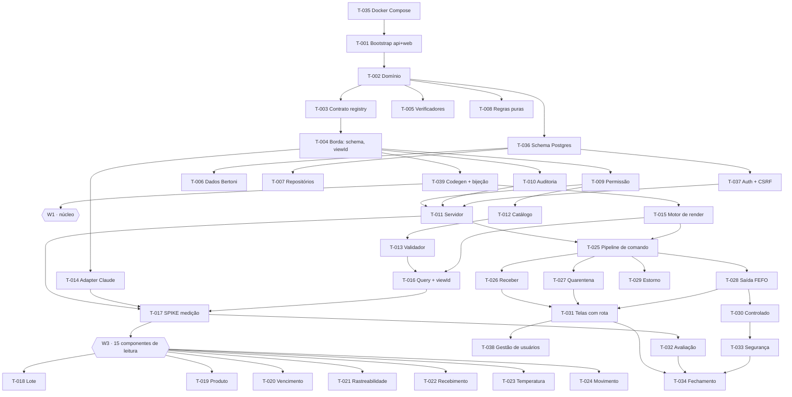

# Plano — Ciclo 1

As ondas, as trilhas e o grafo de dependências. **Isto quase não muda durante
a execução** — por isso saiu do [BOARD](./BOARD.md), que é editado a cada
tarefa assumida e a cada tarefa concluída.

Procurando o estado de uma tarefa? → [BOARD](./BOARD.md) · [PROGRESSO](./PROGRESSO.md)

---

## 1. Ondas

Uma onda não é prazo, é **barreira de dependência**. Tarefas da mesma onda são
paralelizáveis; a seguinte abre quando as dependências declaradas fecham.

| Onda | O que é | Paralelismo | Abre com |
|---|---|---|---|
| **W0** | Ambiente e contratos congelados | **Serial** | — |
| **W1** | Núcleo: banco, dados, permissão, auth, registry, render | até 13 sessões | T-039 ✅ |
| **W2** | Furo de risco: medição com modelo real | 1 sessão | W1 ✅ |
| **W3** | 15 componentes de leitura | até 7 sessões | T-017 revisado |
| **W4** | 7 componentes de escrita | até 5 sessões | T-025 ✅ — **aberta** |
| **W5** | Garantias e fechamento | até 4 sessões | W4 ✅ |

**W0 é serial de propósito.** Sete tarefas em sequência compram treze simultâneas.

---

## 2. Trilhas

| Trilha | Domínio | Onde |
|---|---|---|
| **A** | Domínio e dados | `api/src/estoque/{domain,data}` · `api/migrations` |
| **B** | Servidor, permissão, auth, auditoria | `api/src/estoque/{server,autorizacao,auditoria,auth,commands}` |
| **C** | Registry e assistente | `api/src/estoque/{registry,schema,assistant}` |
| **D** | Render e interface | `web/src/**` |
| **E** | Ambiente e qualidade | raiz · `web/scripts` · `api/tests` · `eval/` |

**Tarefas de W3 e W4 atravessam A/C e D** — registro em Python, view em TypeScript
([ADR-0017](../adr/0017-registry-servidor-views-cliente.md)). O teste de bijeção
recusa meia entrega.

---

## 3. Grafo de dependências

**Caminho crítico** (12 tarefas):
`T-035 → T-001 → T-002 → T-003 → T-004 → T-039 → T-012 → T-015 → T-016 → T-017 → T-018 → T-027 → T-031 → T-034`

---
